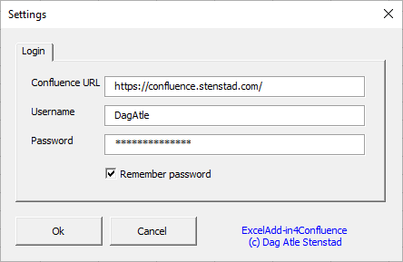

## ExcelAdd-in4Confluence, Excel Add-in for Confluence

ExcelAdd-in4Confluence is an Open Source Excel Add-in that allows you to connect your Confluence-data directly to Microsoft Excel. 
ExcelAdd-in4Confluence is written in Visual Basic for Application (VBA) in Excel and saved as an Add-in. This means you can use all this functionality directly from all your Excel sheets. 

# Installation
1. Downaload the latest [version of ExcelAdd-in4Confluence](https://github.com/DagAtleStenstad/ExcelAdd-in4Confluence/archive/master.zip).
2. Unzip the file. 
3. Add ExcelAdd-in4Confluence as a new [Add-in in Excel](https://support.office.com/en-us/article/add-or-remove-add-ins-in-excel-0af570c4-5cf3-4fa9-9b88-403625a0b460).
4. Start Excel og write this formula in a optional cell: **=ConfluenceSettings()**
5. Fill in your Confluence URL, username and password. Click <Ok> to save the change. 

#  Use/ formulas
Excel will come up with suggestions as you write a formula. In the suggestion list you can navigate with the arrow keys and press <Tab> to auto-complete and <Tab> again to select.

**=ConfluenceSettings()** open the Add-inn Settings windows. Here you can set:
* Confluence URL (URL to your Confluence instance)
* Your Confluence username
* Your Confluence password

**=ConfluenceLookupTableValue(ConfluncePageID; GetColum; WhereColumn; Value )** Lookup table value

To [get the Confluence page ID](https://confluence.atlassian.com/confkb/how-to-get-confluence-page-id-648380445.html).

Example: =ConfluenceLookupTableValue("123123123123"; "Name"; "ID"; "123") 
In this sample the function will lookup the Name where the ID column has value 123.